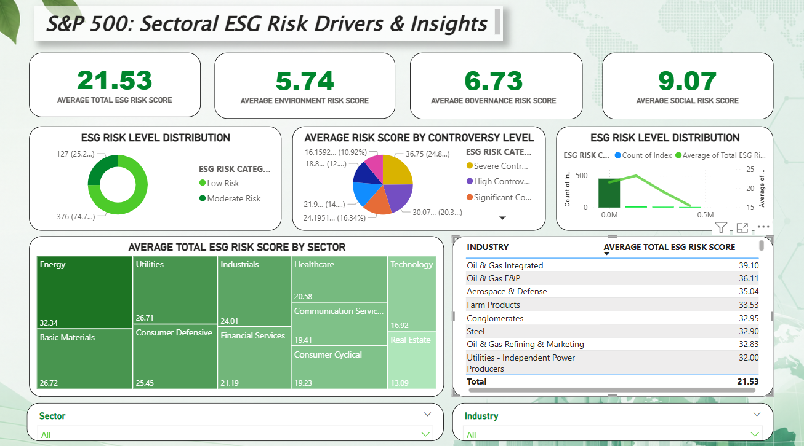

# ESG Analytics Dashboard 📊

This project analyzes ESG (Environmental, Social, Governance) risk data to understand sustainability risks across companies and industries.

## 🔍 Objective
To identify ESG risk patterns and compare companies based on environmental, social, and governance factors.

## 📊 Key Insights
- Most companies fall under low to moderate ESG risk
- Social risk contributes the most to overall ESG score
- Energy and Basic Materials sectors show higher environmental risk
- Company size shows moderate correlation with ESG risk

## 🛠 Tools Used
- Power BI (Dashboard & Visualization)
- Microsoft Excel (Data Preparation)

## 📂 Dataset
Public ESG dataset sourced from Kaggle

## 📸 Dashboard Preview

## ⚠️ Note
Dataset contains raw and unfiltered fields (e.g., long descriptions, addresses). The focus of this project is on analytical insights and dashboarding.

## 🚀 Author
Jatin Sharma